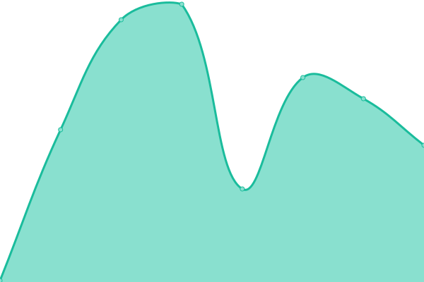
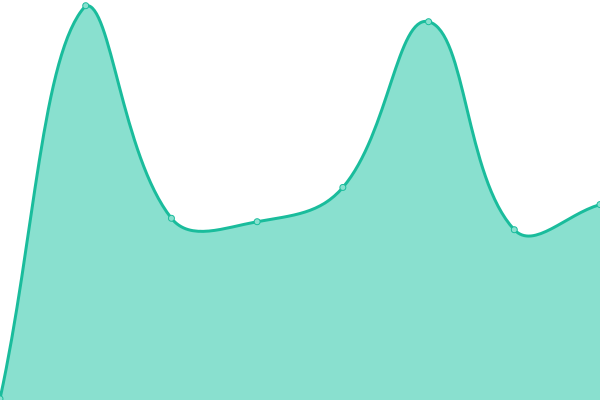
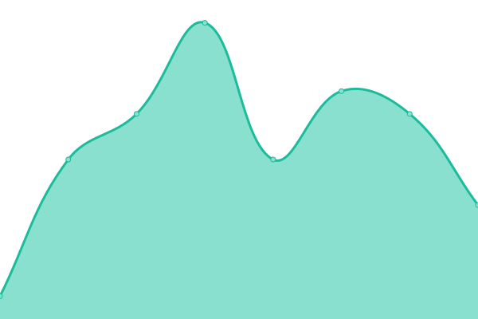
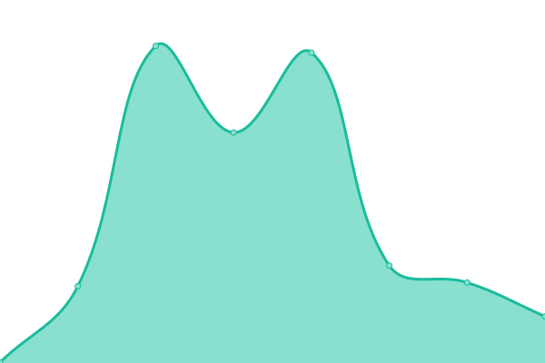

# [📈 Live Status](https://status.section31.earth): <!--live status--> **🟥 Complete outage**

This repository contains the open-source uptime monitor and status page for [Section 31](https://section31.earth), powered by [Upptime](https://github.com/upptime/upptime).

With [Upptime](https://upptime.js.org), you can get your own unlimited and free uptime monitor and status page, powered entirely by a GitHub repository. We use [Issues](https://github.com/Sec31/status/issues) as incident reports, [Actions](https://github.com/Sec31/status/actions) as uptime monitors, and [Pages](https://status.section31.earth) for the status page.

<!--start: status pages-->
<!-- This summary is generated by Upptime (https://github.com/upptime/upptime) -->
<!-- Do not edit this manually, your changes will be overwritten -->
<!-- prettier-ignore -->
| URL | Status | History | Response Time | Uptime |
| --- | ------ | ------- | ------------- | ------ |
|  [TNR: Pterodactyl Panel](https://panel.truenorthroleplay.net) | 🟥 Down | [tnr-pterodactyl-panel.yml](https://github.com/Sec31/status/commits/HEAD/history/tnr-pterodactyl-panel.yml) | 

 97ms
     
 | 

<a href="https://status.section31.earth/history/tnr-pterodactyl-panel">100.00%</a>
    

|  TNR: Pterodactyl Wings (Node #01) | 🟥 Down | [tnr-pterodactyl-wings-node-01.yml](https://github.com/Sec31/status/commits/HEAD/history/tnr-pterodactyl-wings-node-01.yml) | 

 0ms
     
 | 

<a href="https://status.section31.earth/history/tnr-pterodactyl-wings-node-01">0.00%</a>
    

|  EXT: Rex's ARK | 🟥 Down | [ext-rex-s-ark.yml](https://github.com/Sec31/status/commits/HEAD/history/ext-rex-s-ark.yml) | 

 21ms
     
 | 

<a href="https://status.section31.earth/history/ext-rex-s-ark">0.00%</a>
    

|  MeshCentral (RMM) | 🟥 Down | [mesh-central-rmm.yml](https://github.com/Sec31/status/commits/HEAD/history/mesh-central-rmm.yml) | 

 0ms
     
 | 

<a href="https://status.section31.earth/history/mesh-central-rmm">0.00%</a>
    

<!--end: status pages-->

[**Visit our status website →**](https://status.section31.earth)

## 📄 License

- Powered by: [Upptime](https://github.com/upptime/upptime)
- Code: [MIT](./LICENSE) © [Section 31](https://section31.earth)
- Data in the `./history` directory: [Open Database License](https://opendatacommons.org/licenses/odbl/1-0/)
